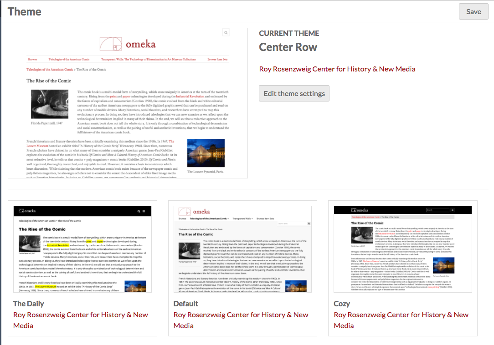
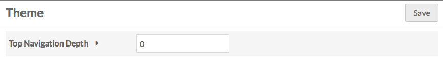
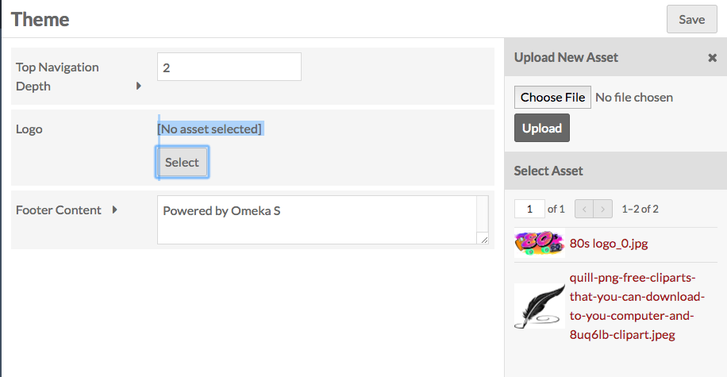
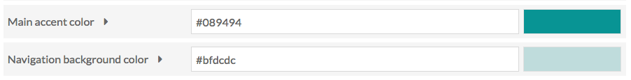
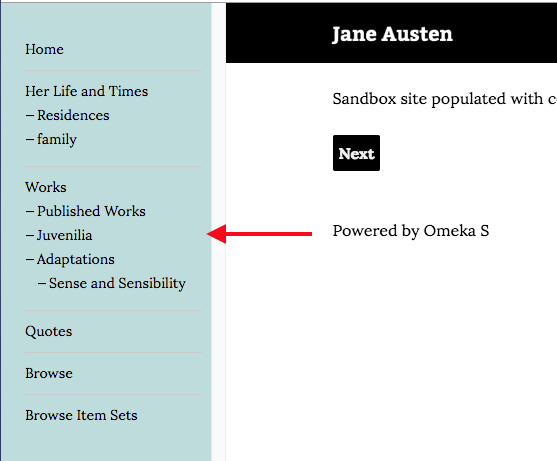

The Theme tab of the site context menu allows you to select the theme for your site, and to set theme-specific settings. 

Select a Theme
---------------------------
When you navigate to the Theme tab, the current theme will appear on the top of the page. If you did not select a theme when adding the site, this will be the Default theme. 

A large image of the theme in action appears on the left, with the theme Title, creator, and a button for Theme Settings on the right.

Below the current theme are buttons for all other installed themes. The buttons have a small image of the theme in action, the theme name, and a link to the creator of the theme. 

To switch themes, click on the theme which you want to use. It should highlight slightly in gray, with a checkbox in the lower right-hand corner of the theme button. 

Click the Save button in the upper right-hand corner of the window to save changes. 

Theme Settings
---------------------------
Theme settings allow you to customize aspects of the site's theme, such as adding a logo to the top or writing footer text. 

To edit the settings of your selected theme, click on the button labeled *edit theme settings* to the right of the current theme thumbnail (highlighted with an arrow in the below image).

Note that your settings for a specific theme on a site will be saved even if you change themes. For example, if you customized the footer for the default theme, then switched to using The Daily for a while, then switched back to the default theme, your custom footer would still be there.

### Settings Options
Depending on which theme you have selected, you may see any of the following setting options:

#### Top Navigation Depth
(Default, Cozy)

Top Navigation Depth allows you the limit the depth of the top navigation menu on the public side of the site.  The default setting, 0, does not restrict the number of levels of the top navigation menu. Setting it to one would only show the top-level pages or links of your site.

#### Logo
(Default, Center Row, The Daily, Cozy)

Upload a asset (file) to function as a logo in the header of your site. 

This asset is not associated with any of the items, and will be stored separately; once uploaded to a site you will be able to select it again without re-uploading even if you change themes for a while. Any asset uploaded to one site will be available for all sites on the installation/.

To upload a logo, click the Select button. This will open a sidebar where you can either upload a new file from your computer or choose from assets already uploaded to the installation.

Note that the logo completely replaces the header, including the site title, for the site, so you may want to consider an image with text if it is important to you that users see the site title.

To remove a logo, click the *clear* button in that block (only visible when a logo is active) and save changes.

#### Footer Content
(all themes)

A text field in which you can enter content to appear in the footer of the site.

By default the message is Powered by Omeka S. 

You can add HTML formatting to the text by manually adding the tags. 

#### Color Selection
(Cozy)

The theme Cozy includes the option to enter values for colors for the *main accent color* and *navigation background color*

The Main Accent color is used for link text and on-hover colors, as in the image below: 

The navigation background color sets the color of the navigation sidebar for the theme. 

Edit either field by typing a [color value](https://en.wikipedia.org/wiki/Web_colors) into the field. Either a triplet or a six-character hexadecimal code will work. Once you have entered a valid value, the color bar on the left will automatically update to show the color entered, even without saving changes.

The default values are stored in the prompt text for the field. For the Cozy theme, the default values are: main accent color is `089494` and navigation background color is `bfdcdc`
