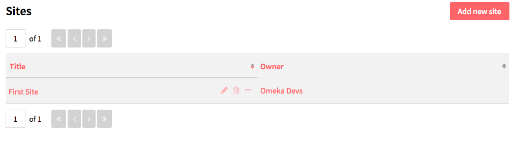

Sites are the public-facing side of an Omeka-S installation. With sites you can create content and interpretation around a group of items from your installation. 

Sites are managed and access via the *Sites* tab on the left-hand side of the administrative dashboard. 

The manage sites page displays a table with all the sites for the installation, giving the title and owner for each site. Either of these columns can be used to sort the list of sites by using the up and down arrows on the right edge of the column heading.

Each row gives the title of a site, options to *edit* (pencil), *delete* (trash can), or *view details* (ellipses), and the owner of the site. *Only global admins and site owners can delete a site.*

Clicking on the site title will take you to the public side of the site. 

## Adding a site
To create a site, click the *Add new site* button in the upper right-hand corner of the page. 

You will need to:
* create a *slug* for the site’s url. The url will be *installurl/site/slug*
* Give your site a *title*
* Select which *theme* you want for the site or whether to go with the installation default. Themes set the appearance of the site.

In the upper right hand corner of the screen, next to the *Add* button, you can set the visibility of your site using the the *make public/private* button (eye icon).

 Public 

  Private

You will probably want to leave the site Private until you have added some content.

## Editing a Site
To edit a site click on the *edit* (pencil) icon for the site on the manage sites page. Note that clicking the site title takes you to the public version of the site.

On the *Admin* tab on the edit site page, you can change the site’s *URL Slug*, *Title*, and *Theme*

On the *Pages* tab you can add, edit, and delete [pages](../sites/pages.md) for the site.

On the *Navigation* tab you can manage the navigation for your site, adding the pages you build, browse pages for items and item sets, and external links.

On the *User permissions* tab you can manage which users can access the administrative side of the site. 

From any tab you can use the the *make public/private* button (eye icon) to set whether the site is visible to the public or only to users of the Omeka S system. 

 Public 

  Private

## Managing Site Users
To add a user to a site, navigate to the *User permissions* tab (see above).

On the right hand side of the screen a drawer will appear that shows all of the users for your install, sorted by the first letter of their first name. To add a user, click on their name. You will then be prompted to check various boxes:

Viewer: user can see the site’s backend but cannot edit.
Editor: user can access and edit the site’s backed.
Admin: user has full administrative privileges for the site, including adding users and deleting the site.

Once you've added one or more users, click the Save button located in the upper right hand corner. You can add or revoke privileges for users by going back to the User permissions tab and selecting or deselecting the boxes and clicking Save. Users can be deleted from the site by clicking the trash can icon located next to the Edit box.

## See also
- [Site Navigation](../sites/site_navigation.md)
- [Site Pages](../sites/site_pages.md)