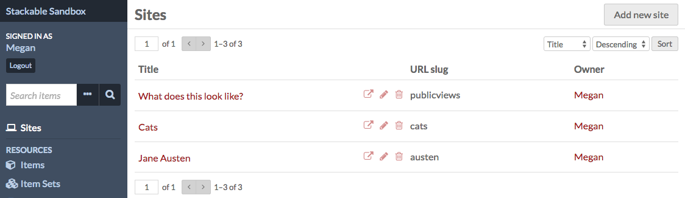
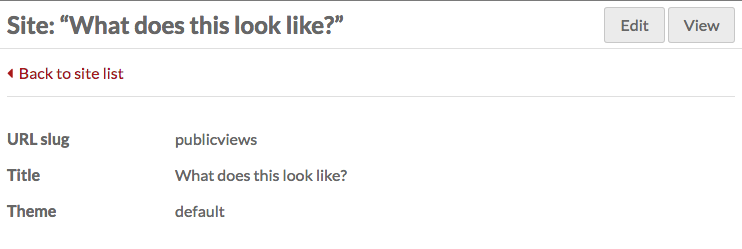
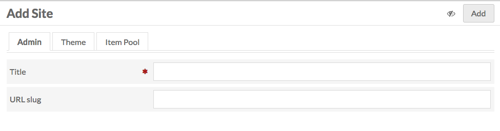
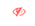
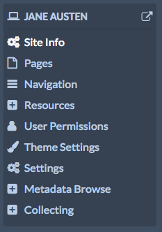
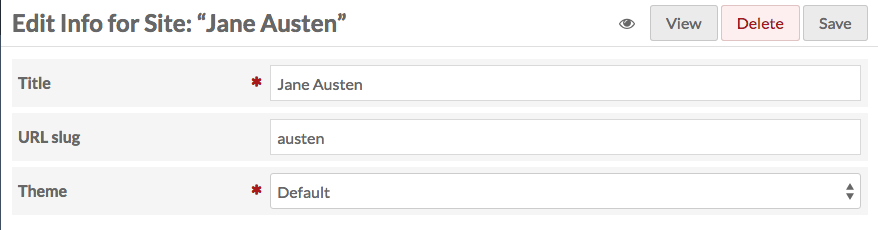
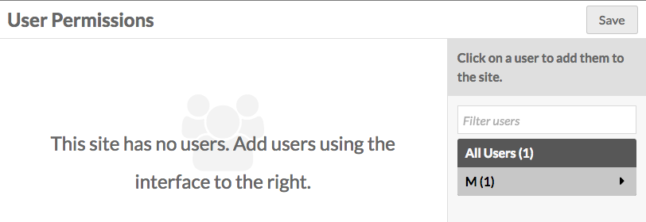
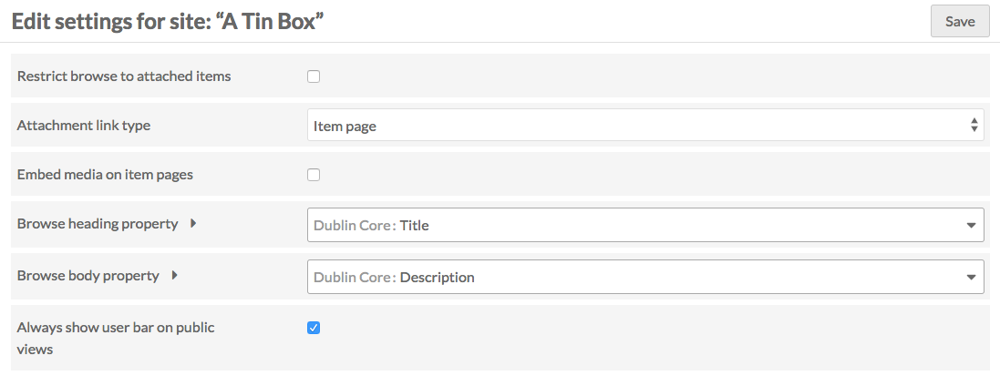

Sites are the public-facing side of an Omeka-S installation. With sites you can create content and interpretation around a group of items from your installation. 

Sites are managed and access via the *Sites* tab on the left-hand side of the administrative dashboard. 

The manage sites page displays a table with all the sites for the installation, giving the title and owner for each site. Either of these columns can be used to sort the list of sites by using the up and down arrows on the right edge of the column heading.

Each row gives the title of a site, options to *view* (box with outward arrow), *edit* (pencil), or *delete* (trash can), and displays the owner of the site. *Only global admins and site owners can delete a site.*

Clicking on the site title will take you to a summary page for the site which displays the site’s *url slug,* and *title,* from which you can return to the site list using a button on the left side of the scree, or *edit* or *view* the site using buttons in the upper right 

## Adding a site
To create a site, click the *Add new site* button in the upper right-hand corner of the site browse page.

The Add New Site page has three tabs: Admin, Theme, and Item Pool.

### The Admin tab
* Give your site a *title* (required)
* create a *slug* for the site’s url. The url will be *installurl/site/slug*. This is optional - if you leave this field blank, Omeka S will create a slug based on the site title.

### The Theme tab
Select from the installed themes. Each theme appears as a button with a screenshot of the theme, the theme name, and a link to its creator. When a theme is selected, it will highlight slightly in gray and a checkbox will appear in the bottom right corner of the button.

### The Item Pool tab
Set up the [item pool](../sites/site_resources.md#item-pool.md) for the site.

### Publication settings
In the upper right hand corner of the screen, next to the *Add* button, you can set the visibility of your site using the the *make public/private* button (eye icon).

 Public 

  Private

You will probably want to leave the site Private until you have added some content.

### Add site
When you are ready, click the *Add* button in the upper right corner. Once the page is created, you will be redirected to the site info tab of the site management. 

## Manage a site
To manage a site, navigate to the *Sites* tab from the Omeka S Admin Dashboard. Click either on the site’s title or the edit (pencil) button in the list of sites. 

This will take you to the Site Info page, and open the context menu for that site in the left hand navigation. 

The context menu for every site has the site title at the top, with an icon of a computer (the site icon) to the right. To the left of the site title is a view button (box with escaping arrow). Clicking the view button will open the public side of the site in a new window.

Site admin left hand navigation options are: 
- *Site Info*, (see below)
- *[Pages](../sites/site_pages.md)*, 
- *[Navigation](../sites/site_navigation.md)*, 
- *[Resources](../sites/site_resources.md)*,
- *User Permissions*, (see below)
- *[Theme](../sites/site_theme.md)*
- *Settings*. (see below)
- Modules, if installed.

Any modules which you have installed that have site-specific settings will appear below the site Settings tab in the site's context menu. In the image above, the modules Metadata Browse and Collecting are installed.

The standard options in the left hand navigation of the Omeka S Admin (items, item sets, etc) are still available below the site context menu. 

## Site Info 
The site info settings for an Omeka S site are where you can change the basic info for the site:
* *title* (text)
* *slug* (text)

In the upper right hand corner of the window on this tab, you can use buttons to:
- *Public/Private button* (see below);
- *View* the public side of the site;
- *Delete* the site;
- *Save* changes.

The *make public/private* button (eye icon) is used to both indicate and set whether the site is visible to the public or only to users of this Omeka S installation 
Site is public:
 

Site is Private:

## See also: 
* [Site Pages](../sites/site_pages.md)
* [Site Navigation](../sites/site_navigation.md)
* [Site Resources](../sites/site_resources.md)
* [Theme](../sites/site_themesettings.md)

## Managing User Permissions
To add a user to a site, navigate to the *User Permissions* tab.

A drawer on the right hand side of the screen shows all of the users for your install, sorted by the first letter of their first name. 

To add a user, click on their name. 

Then select their role from the dropdown:
* *Viewer*: user can see the site’s backend but cannot edit.
* *Editor*: user can access and edit the site’s backend.
* *Admin*: user has full administrative privileges for the site, including adding users and deleting the site.

Once you've added one or more users, click the Save button located in the upper right hand corner. You can add or revoke privileges for users by going back to the User permissions tab and selecting or deselecting the boxes and clicking Save. Users can be deleted from the site by clicking the trash can icon on their row.

## Settings
This tab allows you to configure settings for the site overall.

The first setting is a check box to *Restrict browse to attached items*. If checked, users adding content to sites pages will only be able to access items designated in the Item Pool, and the public browse page will be limited to that content as well.

The second setting option is *Attachment link type*, which sets the target of links from attachments you add to [site page blocks](../sites/site_pages.md#editing-pages) (for example, in an [item showcase](../sites/site_pages.md#item-showcase). It offers a dropdown with the following options:
- *item page:* clicking on the attachment takes users to the item page associated with the attached media;
- *media page:* clicking on the attachment takes users to the media page; 
- *direct link to file:* clicking on the attachment takes user to the file alone. 

